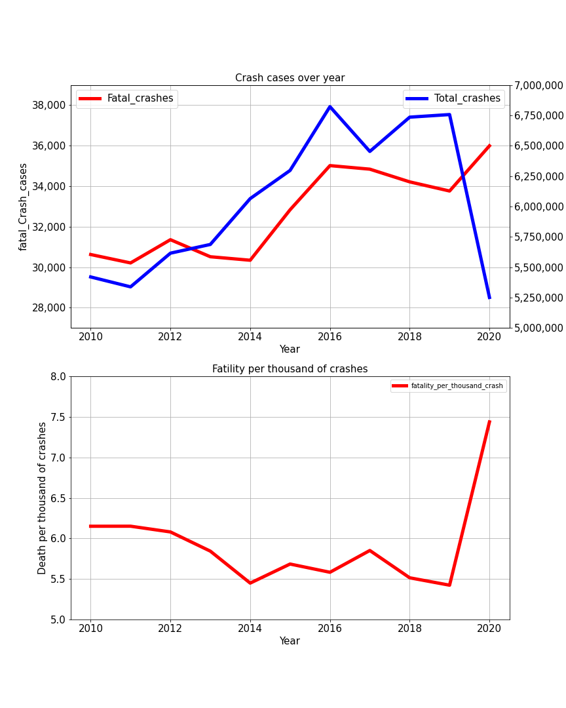
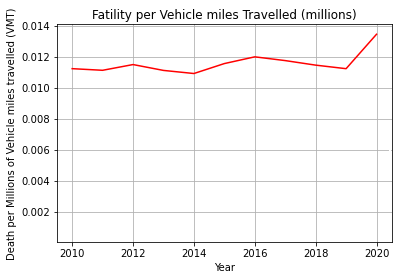
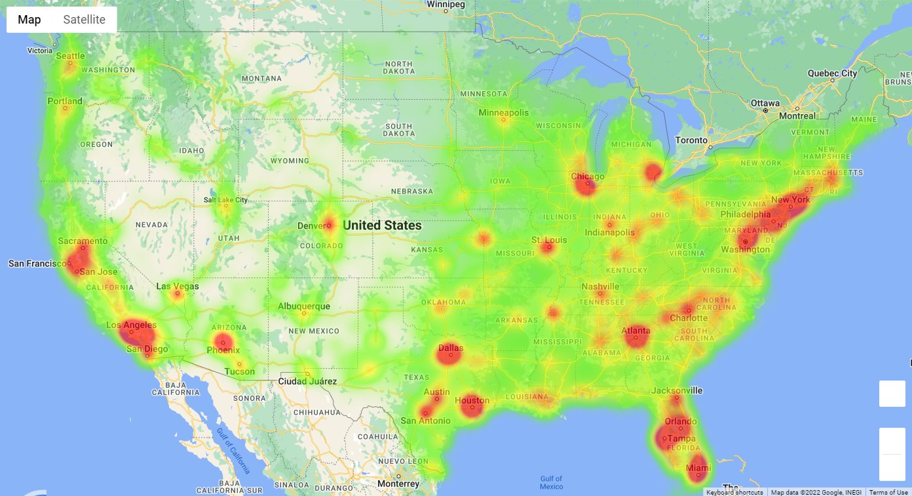
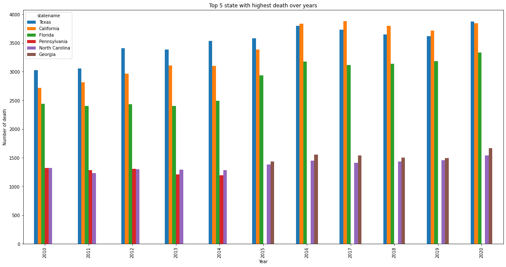
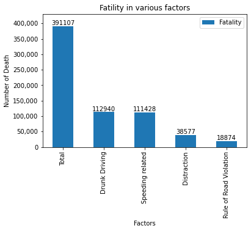
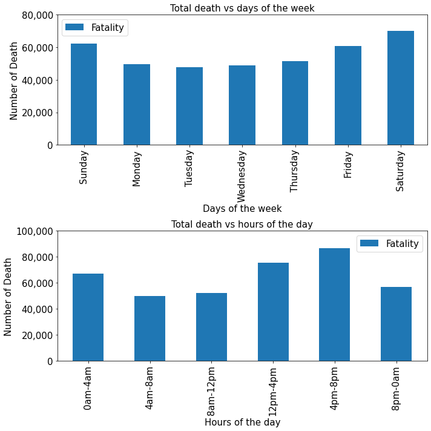
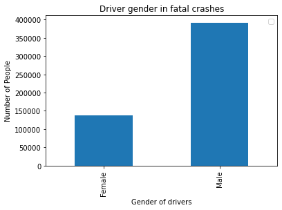

# Motor_vehicles_crashes_data_analytics

Road traffic is the most common traffic in the world. We commute daily using cars, motorbikes, or buses ... How safe for us to go out of the house and enter road traffic? Does road traffic become safer in the last ten years? Which states have the most incidents? What are some of the high-risk factors involved in vehicle crashes?
I used the dataset from https://crashviewer.nhtsa.dot.gov/CrashAPI/ to get the crash data in the USA for the last ten years. The data is available through APIs, so we can stay updated when new data becomes available. The raw data was then cleaned and visualised using charts and a heat map. Some of the key findings are shown below.

The total number of crashes increased from 2010 to 2019 and dropped in 2020 due to the Covid 19 pandemic. However, the number of fatal crashes still increased in 2020, although the total number of hits decreased. On average, ~5.5-6 people died in every 1000 crashes from 2010-2019. This number increased to 7.5 death per thousand crashes in 2020.

Normalising the number of death by the total vehicle miles travelled also shows an 18% increment in the death rate.

Plot the heatmap using the Longitude and Latitude with the number of deaths as a weight; we can see the East coast has more fatal crashes than the West coast. Most of the crashes happened in the big cities of the states

Texas, California and Florida were the top 3 states with the highest number of death. These are also the most populous states in the USA.

Drunk driving and Speeding are the most dangerous behaviours. For every three fatal crashes, there is almost 1 case related to drunk driving. Speeding has a similar rate of risk. 

Saturday has the highest number of death compared to other days. Friday, Saturday and Sunday are the top 3 days with highest fatal crashes. From 4 pm to 8 pm has the highest number of death. The number of deaths that happened at night is about equal to the number of deaths that occurred in day time despite much less traffic. Driving at night is also increasing the risk of fatal crashes.

Male involved in more fatal crashes than female, about 2.6x times higher.

In conclusion, road traffic didn't become safer in the last 10 years. During the pandemic in 2020, the fatality rate increased significantly compared to previous years. Motor vehicle driving is still manual and mainly depends on the driver's behaviours and the environmental situation.
